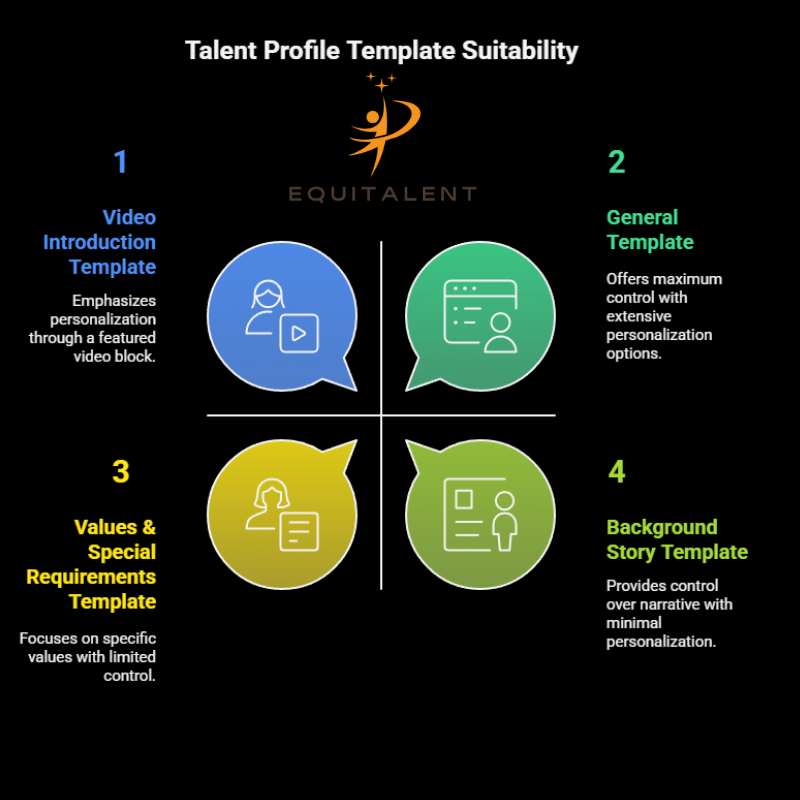
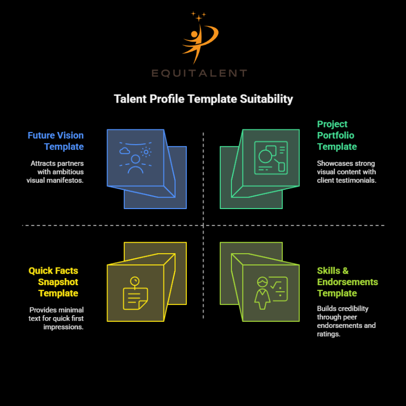

# Templates

## **Functional Description: Talent User Profile Templates**

Our platform offers flexible **profile templates** that talent users can choose from, depending on how they want to present themselves to potential matches, collaborators, or employers. Each template is designed to highlight different aspects of a person’s story, skills, or needs — allowing for self-expression and better alignment with opportunities.

### **Core Templates**

1. **General Template**
   - **Purpose:** A free-form template with no fixed focus. Users can freely build their profile step-by-step, adding or skipping sections as they go.
   - **Core Elements:** Basic info, skills, experiences, portfolio, optional sections (video, story, values).
   - **Who it suits:** Users who want full control over what and how much they share.
2. **Video Introduction Template**
   - **Purpose:** Puts a video front and center so users can introduce themselves in their own words and style.
   - **Core Elements:** Featured video block at the top; supporting sections for bio, skills, contact details.
   - **Who it suits:** Users who feel more comfortable speaking than writing, or want to convey personality, energy, or communication style.
3. **Background Story Template**
   - **Purpose:** Highlights the user’s personal or professional journey to showcase growth, resilience, or unique experiences.
   - **Core Elements:** Long-form narrative section; timeline or milestones feature; space for photos, testimonials.
   - **Who it suits:** Users with non-linear paths or powerful stories that differentiate them.
4. **Values & Special Requirements Template**
   - **Purpose:** Brings user’s core values, work preferences, and any specific needs or accommodations to the forefront.
   - **Core Elements:** Values statement; dealbreakers or must-haves; preferred work conditions; optional diversity statement.
   - **Who it suits:** Users seeking a strong values match or needing to communicate accessibility or cultural fit.

---

## **Creative Additional Templates**

5. **Skills & Endorsements Template**
   - **Purpose:** Highlights skills, competencies, and peer endorsements or ratings.
   - **Core Elements:** Skills matrix; badge system; short quotes or endorsements from colleagues or clients.
   - **Who it suits:** Users who want credibility through social proof.
6. **Project Portfolio Template**
   - **Purpose:** Focuses on tangible work examples.
   - **Core Elements:** Gallery or case studies; project descriptions; links to work; optional client testimonials.
   - **Who it suits:** Creatives, freelancers, or professionals with strong visual or documented work.
7. **Future Vision Template**
   - **Purpose:** Lets users showcase their ambitions, goals, and the type of impact they want to make.
   - **Core Elements:** Future statement; dream roles or projects; call to collaborators; optional video or manifesto.
   - **Who it suits:** Users who want to attract like-minded partners for future ideas.
8. **Quick Facts Snapshot Template**
   - **Purpose:** Provides a short, punchy, easy-to-scan profile.
   - **Core Elements:** Fun facts; bullet points for key achievements; one-liner bio; contact links.
   - **Who it suits:** Users who prefer minimal text and quick first impressions.

---

## **How It Works**

- Users select a template when creating or editing their profile but can switch at any time.
- Each template provides default blocks but allows customization so users can add, remove, or rearrange sections.
- Guidance and prompts are provided to help users get the most out of their chosen format.
